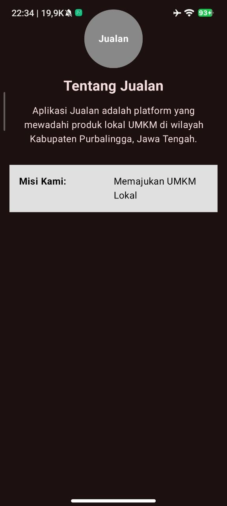
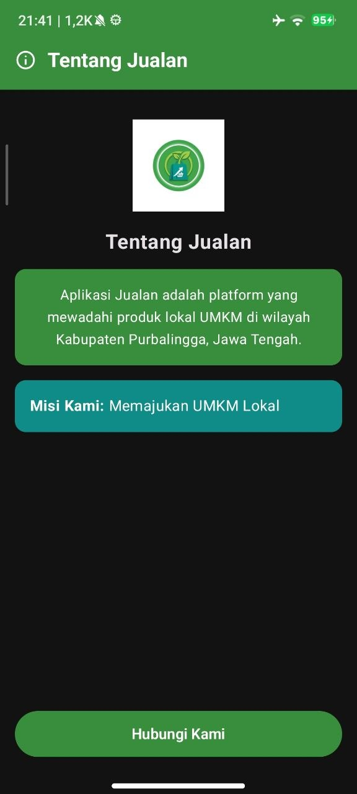
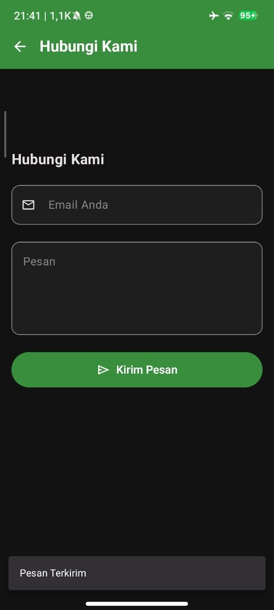
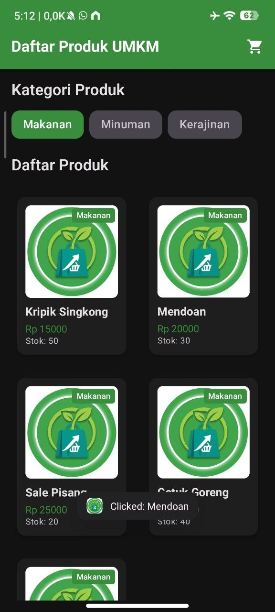

# Jualan App — Praktikum Pemrograman Mobile

## Identitas
| Field | Detail |
|-------|--------|
| **Nama** | Muhammad Faqih Muhyiddin |
| **NIM** | H1D024068 |
| **Shift Awal** | E |
| **Shift Baru** | D |

---

## Deskripsi Aplikasi

**Jualan** adalah aplikasi Android berbasis **Jetpack Compose** yang menampilkan katalog produk secara dinamis melalui REST API. Aplikasi ini dikembangkan secara bertahap setiap pertemuan praktikum, mulai dari tampilan statis hingga integrasi API dan navigasi antar halaman.

---

## Teknologi yang Digunakan

| Teknologi | Keterangan |
|-----------|------------|
| Kotlin | Bahasa pemrograman utama |
| Jetpack Compose | UI toolkit modern Android |
| Navigation Compose | Navigasi antar screen |
| Retrofit 2 | HTTP client untuk REST API |
| Gson Converter | Parsing JSON ke data class |
| ViewModel + StateFlow | Manajemen state UI |
| Coroutines | Asynchronous programming |

---

## Fitur Utama

- 📋 **Daftar Produk** — Menampilkan daftar produk dari API dengan filter kategori
- 🔍 **Detail Produk** — Halaman detail produk lengkap dengan gambar dan deskripsi
- 📞 **Hubungi Kami** — Halaman kontak dengan informasi toko
- 🌐 **Integrasi REST API** — Data produk dan kategori diambil dari `https://pemmob-if.web.app/`
- 🔄 **State Management** — Loading, Success, dan Error state menggunakan `StateFlow`

---

## Arsitektur

```
com.pemmob.mfqh/
├── data/
│   └── model/          # Data class (Product, Category)
├── network/
│   └── ApiInterface.kt # Retrofit API interface & ApiClient
├── ui/
│   ├── screen/         # Composable screens (Daftar, Detail, HubungiKami)
│   ├── viewmodel/      # ProductViewModel dengan StateFlow
│   └── theme/          # JualanTheme
└── util/
    └── JualanConstants.kt  # BASE_URL dan konstanta lainnya
```

---

## Screenshot

### Pertemuan 1

<p align="left">
  
</p>

### Pertemuan 2

<p align="left">
  
  
</p>

### Pertemuan 3

<p align="left">
  
  
</p>

### Pertemuan 4

https://github.com/user-attachments/assets/4e5b61c3-1ba6-467a-97f4-70e68540787b

### Pertemuan 5 — Integrasi REST API

<p align="left">
  
  
</p>

**Demo Video Pertemuan 5:**

https://github.com/empakih/Prak-Pemrograman-Mobile/raw/main/docs/screenshot/document_6201832724160851993.mp4
